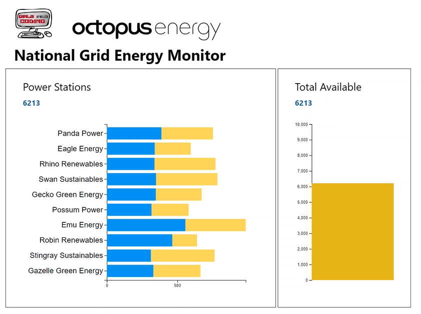

# Girls Into Coding Renewal Energy Workshop
## Web Service Code

This is the code for the web service which acts as the "National Grid", collecting energy from the various power stations and distributing it to the consumers (houses).

Uses Python and Flask.
